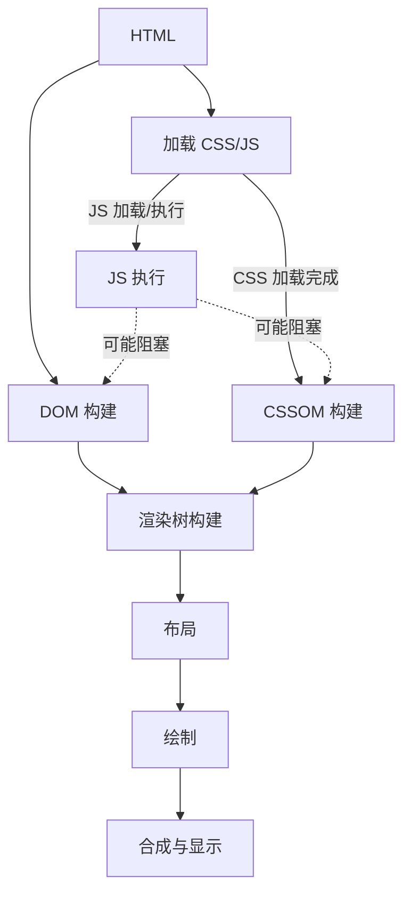

---
title: 关键渲染路径（CRP）的详细步骤
subtitle: ""
date: 2025-10-09T02:17:10+08:00
lastmod: 2025-10-09T02:17:10+08:00
draft: false
authors: []
description: "关键渲染路径 指的是浏览器将 HTML、CSS 和 Java"
tags:
  - 前端八股文
  - Web前端
  - JavaScript
  - CSS
categories:
  - 在前端搬砖的日子里
series:
  - 前端八股文基础
hiddenFromHomePage: false
hiddenFromSearch: false
featuredImage: https://img.dodolalorc.cn/i/2025/10/09/68e6ae83c5df1.png
featuredImagePreview: https://img.dodolalorc.cn/i/2025/10/09/68e6ae83c5df1.png
toc:
  enable: true
math:
  enable: true
lightgallery: false
license: ""
---

**关键渲染路径**  指的是浏览器将 HTML、CSS 和 JavaScript 转换为用户在屏幕上所能看到的像素内容所经历的一系列步骤。

这个过程是“关键”的，因为它直接决定了**首屏内容**的加载速度。优化关键渲染路径的目的就是尽可能快地完成这些步骤，从而缩短白屏时间，提升用户体验。

## 关键渲染路径的流程图

现在，我们来详细拆解图中的每一个步骤：

### 步骤 1 & 2: 构建 DOM 和 CSSOM

- **DOM（文档对象模型）**：
  - **过程**：浏览器读取 HTML 字节数据，将其转换为字符串，然后通过词法分析生成令牌，接着构建节点，最终形成一棵树状结构，这就是 DOM。
  - **特点**：**渐进式构建**。浏览器不会等到所有 HTML 都加载完才开始构建，而是解析到一部分就构建一部分。这也就是为什么我们经常建议将 CSS 放在头部，将 JS 放在尾部。
- **CSSOM（CSS 对象模型）**：
  - **过程**：与 DOM 构建类似，浏览器将 CSS 规则（包括外部样式表、内联样式、行内样式）转换成一棵能描述样式如何应用到 DOM 节点上的树状结构。
  - **特点**：**CSS 是阻塞渲染的资源**。因为浏览器在 CSSOM 构建完成之前，不会渲染任何内容（即使 DOM 已经构建好了），这是为了防止内容在样式加载前后发生闪烁（FOUC - 无样式内容闪烁）。

### 步骤 3: 执行 JavaScript

- **过程**：当浏览器遇到  `<script>`  标签（无论是内联还是外链）时，它会暂停 DOM 构建，先下载（如果是外链）并执行 JavaScript 代码。
- **特点**：**JavaScript 是阻塞解析器的资源**。因为 JavaScript 可能会查询或修改 DOM 和 CSSOM。所以，为了确保 JS 执行结果准确，浏览器必须等待它之前的 CSSOM 构建完成（这就是所谓的“JS 依赖 CSSOM”）。这解释了为什么图中的 JS 执行会受到 CSSOM 构建的阻塞，并且它自己也可能反过来阻塞 DOM 的构建。

### 步骤 4: 构建渲染树

- **过程**：浏览器将 DOM 和 CSSOM 合并成一棵“渲染树”。这棵树只包含**可见的页面内容**。例如，不会包含  `display: none`  的元素或  `<head>`  标签内的元素。

### 步骤 5: 布局

- **过程**：也称为“重排”。浏览器计算渲染树中每个节点的确切位置和大小（像素单位）。视口（viewport）的尺寸直接影响这个计算过程，这就是“响应式设计”的基础。

### 步骤 6: 绘制

- **过程**：也称为“栅格化”。浏览器将布局计算出的每个盒子转换为屏幕上的实际像素。这个过程包括绘制文本、颜色、图像、边框、阴影等。

### 步骤 7: 合成与显示

- **过程**：将绘制好的各个层合成到一起，最终显示在屏幕上。

## 如何优化关键渲染路径？

理解了上述流程，优化的目标就很明确了：**最大限度地缩短完成上述步骤所花费的总时间**。具体策略包括：

1. **减少关键资源数量**：关键资源是指可能阻塞页面首次渲染的资源（如 CSS、同步 JS）。

   - **对于 CSS**：使用  `media`  属性（如  `media="print"`）将非关键 CSS 标记为非关键资源。内联首屏关键 CSS。
   - **对于 JS**：使用  `async`  或  `defer`  属性异步加载非关键 JS，避免其阻塞解析。

2. **优化关键资源大小**：

   - **压缩代码**：使用 Gzip、Brotli 等压缩 HTML、CSS、JS 文件。
   - **精简代码**：移除代码中不必要的注释、空格和未使用的代码。
   - **压缩图像**：使用现代格式（如 WebP），并调整适当尺寸。

3. **缩短关键渲染路径长度**：

   - **优化 CSS**：避免过于复杂的选择器，减少 CSS 的深度。
   - **优化 JS**：避免冗长的 JS 执行时间，拆分任务，使用 Web Worker 处理非 UI 任务。

4. **优先加载关键资源**：

   - 使用  `preload`  指令（`<link rel="preload">`）告诉浏览器优先下载非常重要的资源（如首屏字体、关键 CSS）。

## 总结

**关键渲染路径**是浏览器将代码变成像素的**关键工作流程**。它的核心步骤是：**构建 DOM → 构建 CSSOM → 执行 JS → 构建渲染树 → 布局 → 绘制**。优化它的核心思想是：**减少关键资源、缩小文件体积、优化加载顺序**。
